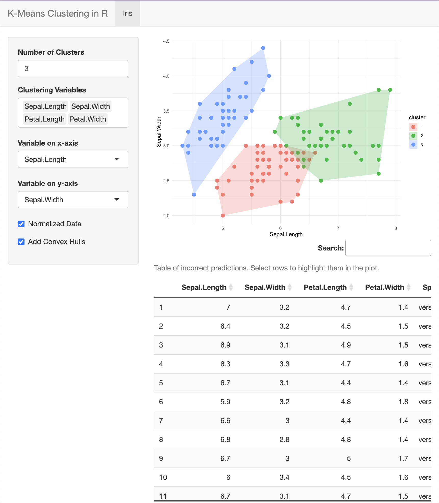

<!-- README.md is generated from README.Rmd. Please edit that file -->

# clustering.fun

<!-- badges: start -->

<!-- badges: end -->

The goal of clustering.fun is to interactively explore k-means
clustering using popular R datasets. Just for fun!

